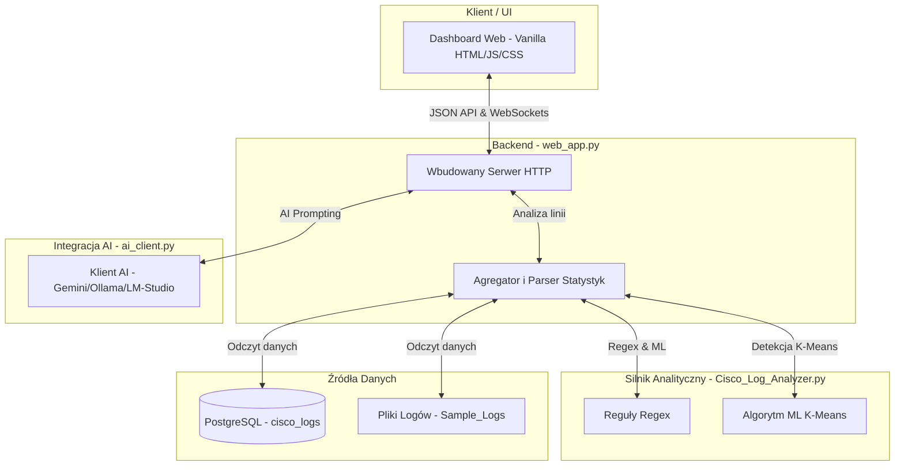

# Cisco Log NMS Dashboard & Security Analyzer

Kompleksowy system klasy NMS (Network Management System) przeznaczony do zbierania, parsowania, analizy bezpieczeństwa oraz wizualizacji logów sieciowych z urządzeń **Cisco IOS** oraz logów systemowych **Linux (Syslog)**. 

System automatycznie wykrywa próby nieautoryzowanego dostępu, ataki brute-force, blokady reguł zapór sieciowych (ACL) oraz awarie interfejsów sieciowych. Wykorzystuje **Uczenie Maszynowe (algorytm K-Means)** do dynamicznego wykrywania urządzeń o podwyższonej awaryjności oraz integruje **lokalne i chmurowe modele językowe (LLM)** do automatycznej interpretacji logów i generowania rekomendacji naprawczych dla administratora sieci.

---

## Spis Treści
1. [Główne Funkcjonalności](#główne-funkcjonalności)
2. [Architektura Systemu](#architektura-systemu)
3. [Instrukcja Konfiguracji i Wdrożenia](#instrukcja-konfiguracji-i-wdrożenia)
4. [Algorytm Detekcji Anomalii ML (K-Means)](#algorytm-detekcji-anomalii-ml-k-means)
5. [Integracja z Sztuczną Inteligencją (LLM)](#integracja-z-sztuczną-inteligencją-llm)
6. [Dokumentacja HTTP JSON API](#dokumentacja-http-json-api)
7. [Przykłady Zdarzeń i Reguły Parsowania](#przykłady-zdarzeń-i-reguły-parsowania)

---

## Główne Funkcjonalności

* **Web Dashboard klasy Premium**: Interfejs w trybie Dark Mode, zbudowany przy użyciu Vanilla JS i CSS, oferujący wskaźniki KPI na żywo, szczegółowe tabele i interaktywne wykresy (Chart.js).
* **Parsowanie w Czasie Rzeczywistym**: Obsługa zdarzeń Cisco IOS (`%SEC_LOGIN`, `%SEC-6-IPACCESSLOGP`, `%LINK-3-UPDOWN`, `%LINEPROTO`, `%PM-4-ERR_DISABLE`) oraz Linux Syslog (sshd, UFW, sudo).
* **Whitelista Adresów IP**: Automatyczna klasyfikacja ruchu sieciowego na podstawie pliku konfiguracyjnego `Allowed_IPS` w celu wykrywania nieautoryzowanych adresów źródłowych.
* **Detekcja Brute-Force**: Grupowanie nieudanych logowań w oknach czasowych i wykrywanie podejrzanych źródeł na podstawie dynamicznych lub zdefiniowanych progów.
* **Diagnostyka Urządzeń ML**: Algorytm K-Means grupuje urządzenia sieciowe na podstawie zdarzeń awarii portów (`Interface changed state to down`), dynamicznie określając stan anomalny bez sztywnych limitów ilościowych.
* **Integracja z LLM**:
  * **Asystent Chatu NMS**: Interaktywny chat z kontekstem ostatnio zebranych logów i statystyk.
  * **Analiza Zdarzenia (Explain)**: Jedno kliknięcie pozwala przetłumaczyć i przeanalizować pojedynczy wpis z logu sieciowego na zrozumiały raport bezpieczeństwa w języku polskim.
  * **Globalny Raport Bezpieczeństwa**: Synteza aktualnego stanu infrastruktury sieciowej generowana przez LLM.

---

## Architektura Systemu

System opiera się na architekturze modułowej, zaprojektowanej bez zewnętrznych frameworków webowych (takich jak Flask czy FastAPI), co ułatwia wdrożenie w środowiskach o ograniczonych zasobach.



### Opis Modułów

1. **`Cisco_Log_Analyzer.py`**:
   * Odpowiada za wczytanie whitelisty adresów IP (`load_allowed_networks`).
   * Zawiera precyzyjnie zdefiniowane wyrażenia regularne (Regex) do ekstrakcji pól: timestamp, typ zdarzenia, IP źródłowe, IP docelowe, port docelowy, nazwa użytkownika oraz nazwa portu fizycznego.
   * Definiuje strukturę danych `LogEvent` i `AnalysisResult`.
   * Implementuje algorytm `detect_anomalies_kmeans`.
2. **`web_app.py`**:
   * Implementuje klasę `Handler(BaseHTTPRequestHandler)` obsługującą trasowanie GET/POST.
   * Generuje dynamiczny interfejs HTML na podstawie zebranych statystyk z bazy danych lub plików.
   * Obsługuje zapytania API chatu AI, testów konfiguracji LLM i pobierania danych z PostgreSQL.
3. **`ai_client.py`**:
   * Stanowi uniwersalny interfejs połączeń sieciowych z modelami LLM.
   * Obsługuje trzech dostawców: `gemini` (Google Gemini API), `ollama` (lokalny endpoint Ollama pod adresem `http://localhost:11434`) oraz `openai` (umożliwiający integrację z lokalnym oprogramowaniem **LM-Studio** nasłuchującym na porcie `1234`).
4. **`init_db.py`**:
   * Skrypt narzędziowy do inicjalizacji oraz odświeżania bazy PostgreSQL.
   * Posiada wbudowany generator z realistycznym randomizatorem adresów IP (70% szans na powtórzenie znanych hostów z listy w celu odwzorowania realistycznego ruchu i 30% szans na całkowicie losowy adres IP wewnętrzny lub zewnętrzny).

---

## Instrukcja Konfiguracji i Wdrożenia

### Wymagania systemowe
* Python 3.9 lub nowszy
* Baza danych PostgreSQL (opcjonalnie, jeśli używany jest tryb `--db`)
* Zainstalowane biblioteki Pythona (wyłącznie biblioteki klienckie):
  ```bash
  pip install psycopg2-binary
  ```

### 1. Przygotowanie Bazy Danych PostgreSQL

Połącz się z konsolą PostgreSQL jako superuser i skonfiguruj użytkownika:

```bash
# Uruchomienie psql i zmiana hasła administratora
sudo -u postgres psql -c "ALTER USER postgres PASSWORD 'ZAQ!2wsx';"
```

> [!IMPORTANT]
> Domyślna konfiguracja projektu zakłada hasło `ZAQ!2wsx` dla użytkownika `postgres` na adresie lokalnym `127.0.0.1:5432`. W przypadku modyfikacji tych parametrów należy przekazać je przy uruchamianiu skryptów za pomocą flag CLI.

Upewnij się, że plik konfiguracji PostgreSQL (`pg_hba.conf`) zezwala na logowanie za pomocą hasła (`md5` lub `scram-sha-256`) dla połączeń lokalnych loopback.

### 2. Generowanie Logów Testowych w Bazie

Uruchom skrypt inicjalizujący bazę, który automatycznie usunie starą instancję bazy `cisco_logs` (jeśli istnieje), utworzy tabele, nałoży indeksy wydajnościowe na kolumnę `device` i wgra 800 losowych logów o zróżnicowanej charakterystyce sieciowej:

```bash
python init_db.py --count 800
```

### 3. Uruchomienie Panelu NMS

Aby uruchomić serwer webowy w trybie pobierania danych z PostgreSQL, wykonaj polecenie:

```bash
python web_app.py --db --port 8080
```

Dashboard będzie dostępny w przeglądarce pod adresem: **`http://127.0.0.1:8080`**.

W przypadku braku dostępu do bazy PostgreSQL, można uruchomić serwer w trybie odczytu tradycyjnych plików tekstowych z logami:

```bash
python web_app.py --no-db --log Sample_Logs/Cisco_ios.log --port 8080
```

---

## Algorytm Detekcji Anomalii ML (K-Means)

Tradycyjne systemy NMS opierają się na sztywnych progach liczbowych (np. *"flaguj urządzenie, gdy awaria portu wystąpi >= 5 razy"*). Taka metoda generuje fałszywe alarmy w dużych sieciach lub pomija incydenty w małych oddziałach. 

Nasze rozwiązanie wykorzystuje **jednowymiarowy algorytm K-Means (dla K=2)** w celu automatycznego podziału floty urządzeń sieciowych na dwie niezależne grupy:
1. **Grupa stabilna (`g0`)**: Urządzenia o znikomej, dopuszczalnej liczbie awarii interfejsów (np. 0-3 awarie w okresie analizy).
2. **Grupa anomalna (`g1`)**: Urządzenia, których liczba awarii interfejsów znacząco odbiega od tła reszty infrastruktury.

### Metodologia obliczeń
1. Inicjalizowane są dwa centroidy: $c_0 = \min(X)$ oraz $c_1 = \max(X)$, gdzie $X$ to zbiór sum awarii portów na poszczególnych urządzeniach Cisco.
2. W maksymalnie 15 iteracjach następuje przypisanie urządzeń do najbliższego centroidu oraz przeliczenie ich średnich wartości.
3. Wyznaczany jest próg podziału (decision boundary):
   $$\text{Threshold} = \frac{c_0 + c_1}{2}$$
4. Urządzenia, których liczba awarii przekracza $\text{Threshold}$, są kwalifikowane do grupy anomalnej.
5. Dla każdego zakwalifikowanego urządzenia wyliczany jest **ML Score**:
   $$\text{ML Score} = \frac{\text{Awarie urządzenia}}{\max(\text{Średnia grupy stabilnej}, 1.0)}$$
   Wskaźnik ten określa, ile razy awaryjność danego urządzenia przewyższa średni poziom floty pracującej w normie.

Urządzenia zaklasyfikowane jako anomalne są automatycznie flagowane w zakładce `/alerts` czerwoną rekomendacją **"Wymagany przegląd fizyczny"** wraz z możliwością natychmiastowej interpretacji AI.

---

## Integracja z Sztuczną Inteligencją (LLM)

Projekt oferuje elastyczną warstwę komunikacji z sztuczną inteligencją wbudowaną bezpośrednio w interfejs administracyjny.

### Obsługiwane Integracje

1. **Google Gemini**:
   * Wymaga podania klucza API Gemini w zakładce "Ustawienia" (Settings) lub ustawienia zmiennej środowiskowej `GEMINI_API_KEY`.
   * Komunikacja odbywa się bezpośrednio z oficjalnym API Google Gemini.
2. **Ollama (Lokalnie)**:
   * Służy do uruchomienia całkowicie lokalnego modelu (np. `llama3`, `mistral`, `gemma`) bez wysyłania danych poza sieć korporacyjną.
   * Domyślny adres: `http://localhost:11434`.
3. **LM-Studio / Inne API zgodne z OpenAI**:
   * LM-Studio udostępnia lokalny serwer w pełni kompatybilny ze specyfikacją OpenAPI.
   * Aby podpiąć LM-Studio, w zakładce "Ustawienia" wybierz dostawcę `openai`, ustaw URL na `http://localhost:1234` i wskaż załadowany w LM-Studio model.

---

## Dokumentacja HTTP JSON API

Serwer udostępnia zestaw punktów końcowych (endpoints) JSON do integracji z zewnętrznymi systemami monitoringu (np. Zabbix, Nagios):

### 1. Pobranie Statystyk Zbiorczych
* **URL**: `/api/stats`
* **Metoda**: `GET`
* **Opis**: Zwraca zagregowane dane liczbowe, listy podejrzanych adresów IP, wykryte anomalie ML oraz najczęściej atakowanych użytkowników (z wyłączeniem pełnej listy zdarzeń w celu optymalizacji rozmiaru odpowiedzi).
* **Format odpowiedzi**:
  ```json
  {
    "total_files": 1,
    "total_lines": 800,
    "failed_total": 312,
    "success_total": 128,
    "acl_total": 210,
    "system_total": 45,
    "port_down_total": 35,
    "brute_force_suspects": [["203.0.113.45", 15], ["198.51.100.23", 12]],
    "anomalous_devices": [["Cisc_WLC1", 10, 3.33]],
    "event_count": 800
  }
  ```

### 2. Pobranie Wszystkich Zdarzeń
* **URL**: `/api/events`
* **Metoda**: `GET`
* **Opis**: Pobiera kompletną listę przeanalizowanych obiektów zdarzeń sieciowych i systemowych.

### 3. Analiza Wpisu przez AI (Explain)
* **URL**: `/api/ai-explain`
* **Metoda**: `POST`
* **Payload**: `{"log_line": "surowy wpis logu"}`
* **Opis**: Zwraca wygenerowaną przez LLM interpretację techniczną w języku polskim, określając poziom zagrożenia oraz sugerowane kroki dla administratora.

### 4. Interaktywny Chat z Kontekstem
* **URL**: `/api/ai-chat`
* **Metoda**: `POST`
* **Payload**: 
  ```json
  {
    "message": "Pytanie administratora",
    "history": [{"role": "user", "content": "..."}, {"role": "assistant", "content": "..."}]
  }
  ```
* **Opis**: Wiadomość jest wzbogacana o statystyki systemu oraz ostatnie 15 logów, tworząc kompletny kontekst dla modelu językowego.

---

## Przykłady Zdarzeń i Reguły Parsowania

Poniższa tabela przedstawia formaty wejściowych logów i sposób ich mapowania na zdarzenia systemowe:

| Przykładowa linia logu | Moduł źródłowy | Wykrywany typ zdarzenia | Kluczowe wyodrębniane pola |
|:---|:---|:---|:---|
| `*Jun 10 08:14:45: %SEC_LOGIN-4-LOGIN_FAILED: Login failed [user: admin] [Source: 203.0.113.45]` | Cisco IOS | `login_failed` | `user=admin`, `ip=203.0.113.45` |
| `*Jun 10 08:45:22: %LINK-3-UPDOWN: Interface GigabitEthernet0/1, changed state to down` | Cisco IOS | `port_down` | `port=GigabitEthernet0/1`, `device` (z kontekstu) |
| `*Jun 10 08:16:03: %SEC-6-IPACCESSLOGP: list 101 denied tcp 45.77.12.9(51234) -> 10.0.0.1(22)` | Cisco IOS | `acl_denied` | `ip=45.77.12.9`, `destination=10.0.0.1`, `dport=22` |
| `Jun 13 12:34:56 localhost sshd[12345]: Failed password for invalid user root from 192.168.1.100` | Linux Syslog | `login_failed` | `user=root`, `ip=192.168.1.100` |
| `Jun 13 12:35:00 localhost kernel: [UFW BLOCK] IN=eth0 SRC=45.77.12.9 DST=10.0.0.1 DPT=22` | Linux Syslog | `acl_denied` | `ip=45.77.12.9`, `destination=10.0.0.1`, `dport=22` |
