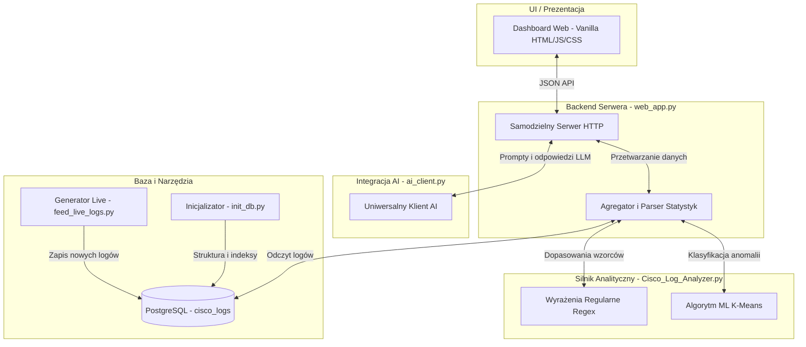

# Specyfikacja i Opis Projektowy: Cisco & System Log NMS

Niniejszy dokument stanowi pełną specyfikację techniczną oraz opis projektowy systemu **Cisco Log NMS Dashboard & Security Analyzer**. Zawiera informacje o architekturze, wykorzystanych technologiach, przeznaczeniu poszczególnych modułów oraz sposobie ich implementacji.

---

## 1. Ogólny Opis Projektu
**Cisco Log NMS Dashboard & Security Analyzer** to zintegrowany, hybrydowy system zarządzania logami klasy NMS (Network Management System). Został zaprojektowany do zbierania, standaryzowania, analizowania i wizualizacji logów sieciowych pochodzących z urządzeń z systemem **Cisco IOS** oraz logów systemowych z serwerów **Linux (Syslog/Auth)**.

### Cel projektu:
* **Ujednolicenie**: Zamiana zróżnicowanych tekstowych wpisów logów (Cisco, Linux sshd, UFW, sudo) we wspólny obiektowy format danych.
* **Detekcja zagrożeń w czasie rzeczywistym**: Wykrywanie ataków brute-force, nieautoryzowanych prób logowania, skanowania portów oraz blokad zapór sieciowych (ACL).
* **Zaawansowana analityka (Machine Learning)**: Dynamiczne wykrywanie urządzeń sieciowych charakteryzujących się anomalną awaryjnością (port flapping / interface down) za pomocą nienadzorowanego uczenia maszynowego (algorytm K-Means).
* **Integracja z AI (Generative LLM)**: Wykorzystanie modeli językowych (lokalnych i chmurowych) do automatycznego objaśniania alertów sieciowych oraz wsparcia administratora w procesie usuwania awarii (Chat Assistant).
* **Niskie wymagania i brak zależności**: Działanie bez ciężkich frameworków webowych (typu Flask/FastAPI), co umożliwia wdrażanie bezpośrednio na słabszych urządzeniach sieciowych i serwerach brzegowych.

---

## 2. Architektura Systemu i Przepływ Danych
Projekt składa się z pięciu głównych modułów skryptowych oraz bazy danych PostgreSQL. Poniższy diagram przedstawia architekturę oraz relacje i przepływ informacji pomiędzy nimi:

---

## 3. Wykorzystane Technologie, Pakiety i Narzędzia

W projekcie świadomie połączono wbudowane mechanizmy języka Python z bazą PostgreSQL i nowoczesnymi technologiami frontendowymi (bez narzutu frameworków takich jak React czy Vue).

### A. Core Języka Python (Standardowe biblioteki)
* **`http.server` (`BaseHTTPRequestHandler`, `HTTPServer`)**: Użyte do zbudowania asynchronicznego serwera sieciowego HTTP. Zapewnia trasowanie (routing) zapytań GET/POST, serwowanie plików HTML/CSS/JS oraz obsługę punktów końcowych JSON API.
* **`ipaddress` (`IPv4Network`, `IPv4Address`)**: Wykorzystywane do parsowania whitelisty podsieci (CIDR) oraz sprawdzania przynależności adresów IP. Umożliwia precyzyjne porównywanie adresów hostów w dużych pulach adresowych.
* **`re`**: Silnik wyrażeń regularnych Pythona. Użyty do prekompilacji i ekstrakcji informacji z logów za pomocą nazwanych grup przechwytujących `(?P<nazwa>...)`.
* **`collections` (`Counter`, `defaultdict`)**:
  * `Counter`: Do szybkiej agregacji i wyszukiwania TOP atakujących IP/użytkowników/urządzeń.
  * `defaultdict`: Upraszcza grupowanie i budowanie struktur bez rzucania błędów `KeyError`.
* **`dataclasses` (`@dataclass`)**: Zapewnia ustrukturyzowane, silnie typowane modele zdarzeń (`LogEvent`) oraz rezultatów analizy (`AnalysisResult`).
* **`argparse`**: Odpowiada za konfigurację interfejsów CLI we wszystkich skryptach, umożliwiając dopasowanie parametrów sieciowych, portów, haseł oraz trybów pracy.
* **`urllib.request`**: Służy do wykonywania niskopoziomowych połączeń HTTP do interfejsów modeli LLM (Gemini, Ollama, OpenAI) bez używania biblioteki `requests`.

### B. Baza Danych i Integracja
* **PostgreSQL (Wersja 12+)**: System zarządzania relacyjną bazą danych. Służy jako centralne archiwum logów.
* **`psycopg2-binary`**: Sterownik (driver) PostgreSQL dla języka Python. Odpowiada za bezpieczne parametryzowanie zapytań SQL, chroniąc przed podatnościami typu SQL Injection.

### C. Technologie Frontendowe
* **Vanilla HTML5 & CSS Variables**: UI zbudowano w całości w trybie ciemnym (Dark Mode), z zaawansowaną paletą kolorów (tokens) i płynnymi przejściami (transitions).
* **Vanilla JS (ES6)**: Obsługuje interaktywność, asynchroniczne odpytywanie API (Fetch API), dynamiczne filtrowanie tabel na żywo oraz obsługę okien modalnych (AI explain).
* **Chart.js (CDN)**: Lekka biblioteka JavaScript do dynamicznego rysowania wykresów (kołowych, słupkowych) reprezentujących rozkład typów logów oraz statystyki ruchu.

---

## 4. Szczegółowy Opis Modułów

### 1. Moduł Analityczny: `Cisco_Log_Analyzer.py`
To serce analityczne systemu. Zawiera definicje wzorców regex, mechanizmy parsowania logów oraz algorytm K-Means.
* **Wyrażenia Regularne (Regex)**: Zawiera 11 prekompilowanych wzorców (np. `RE_LOGIN_FAILED`, `RE_ACL_DENIED`, `RE_LINK_DOWN`, `RE_SYS_UFW_BLOCK`), które standaryzują nieustrukturyzowany tekst do obiektów `LogEvent`.
* **Walidacja IP**: Czyta plik `Allowed_IPS`, ładuje podsieci i sprawdza, czy wykryty ruch pochodzi z zaufanych stref.
* **Algorytm ML K-Means**: Jednowymiarowy algorytm k-średnich dzielący infrastrukturę na dwa klastry (stabilne urządzenia vs anomalne). Wylicza dla anomalii wskaźnik **ML Score** (stosunek awaryjności urządzenia do średniej zdrowej floty).

### 2. Aplikacja Webowa i API: `web_app.py`
Implementuje serwer HTTP oraz udostępnia pełen NMS Dashboard.
* **Trasowanie (Routing)**:
  * `/` (Dashboard): Zestawienie wskaźników KPI (liczba zdarzeń, awarie portów, błędy logowania) z wykresami Chart.js.
  * `/events`: Pagnowana i filtrowana lista wszystkich logów w bazie.
  * `/alerts`: Centrum alertów bezpieczeństwa (brute-force, IP spoza dozwolonych, anomalie ML).
  * `/sources`: Szczegółowe zestawienie TOP IP, urządzeń oraz atakowanych użytkowników.
  * `/chat`: Interfejs konwersacyjny AI, przesyłający aktualny stan systemu jako kontekst do LLM.
  * `/settings`: Konfiguracja wyboru dostawcy LLM (Gemini, Ollama, OpenAI) i kluczy API.
* **JSON API**: Udostępnia punkty końcowe `/api/stats`, `/api/events`, `/api/ai-explain`, `/api/ai-summary` oraz `/api/ai-chat`.

### 3. Integracja z Modelami Językowymi: `ai_client.py`
Uniwersalny, zunifikowany adapter komunikacyjny z systemami sztucznej inteligencji.
* **Google Gemini API**: Bezpośrednia komunikacja z modelami w chmurze (np. `gemini-2.5-flash`) przy użyciu klucza API przekazywanego w nagłówkach.
* **Ollama**: Integracja z lokalnymi instancjami LLM pracującymi w sieci lokalnej firmy (np. `llama3` pod portem `11434`), gwarantując pełną poufność danych.
* **OpenAI API / LM-Studio**: Kompatybilność ze standardem OpenAI API, umożliwiająca integrację z oprogramowaniem LM-Studio (port `1234`) w celach testowych.

### 4. Baza Danych: `init_db.py` & `setup_database.sql`
Inicjalizuje strukturę tabel i ładuje startowy zestaw danych.
* **`setup_database.sql`**: Definiuje tabelę `logs` (`id`, `device`, `log_line`, `created_at`) oraz tworzy indeks B-Tree na kolumnie `device` w celu optymalizacji zapytań agregacyjnych `GROUP BY` wykonywanych przez dashboard.
* **Inicjalizator (`init_db.py`)**: Tworzy bazę danych, uruchamia skrypt SQL i wstawia zadaną liczbę logów testowych. Używa generatorów wagowych (np. 70% szans na powtórzenie znanego IP hosta, co odzwierciedla realny profil ruchu sieciowego).

### 5. Symulator Ruchu na Żywo: `feed_live_logs.py`
Skrypt narzędziowy do testów przeciążeniowych i funkcjonalnych. Wstrzykuje dynamicznie logi do PostgreSQL.
* **Tryb Ciągły**: Co $N$ sekund generuje i wstawia $B$ losowych logów.
* **Tryb Burst**: Generuje natychmiastową serię prób logowania z jednego IP (brute-force) oraz skanowanie portów.
* **Tryb Scenariuszowy**: Symuluje pełny łańcuch ataku (Kill Chain) krok po kroku:
  1. Rekonesans (Skanowanie portów zablokowane przez ACL).
  2. Atak Brute-Force (Seria nieudanych logowań).
  3. Sukces logowania (Przejęcie uprawnień).
  4. Modyfikacja konfiguracji urządzenia (Sabotaż konfiguracji).
  5. Awaria interfejsów (Wyłączenie portów fizycznych).
  6. Szum tła (Normalne logi systemowe).

---

## 5. Przepływy Funkcjonalne w Praktyce

### A. Ścieżka Analizy Logu (Od tekstu do Dashboardu)
1. Log (np. wygenerowany przez urządzenie Cisco) trafia do bazy PostgreSQL za pomocą demona syslog lub symulatora `feed_live_logs.py`.
2. Użytkownik otwiera Dashboard. Serwer `web_app.py` pobiera rekordy z bazy i przekazuje je do parsera `Cisco_Log_Analyzer.py`.
3. Parser za pomocą skompilowanych wyrażeń regularnych wyodrębnia pola (np. IP, port, użytkownik).
4. System sprawdza adres IP w obiekcie whitelisty `ipaddress.IPv4Network`.
5. Obliczany jest stan portów, a dane są przekazywane do algorytmu K-Means.
6. Wyniki są agregowane do formatu JSON, a frontend renderuje KPI oraz wykresy Chart.js.

### B. Ścieżka Wyjaśniania Logu przez AI (1-Click Explain)
1. W tabeli `/events` administrator klika fioletowy przycisk **"Zapytaj AI"** przy wybranym zdarzeniu.
2. JavaScript wysyła zapytanie `POST` do `/api/ai-explain` z surową linią logu.
3. Serwer konfiguruje `AIClient` na podstawie wprowadzonych ustawień.
4. Prompt systemowy (`SYSTEM_EXPLAIN`) instruuje model LLM, aby przedstawił raport zawierający: wyjaśnienie incydentu, poziom zagrożenia oraz sugerowane kroki naprawcze.
5. Model zwraca tekst w formacie Markdown, który jest bezpiecznie parsowany przez frontend i wyświetlany w oknie modalnym (overlay popup).
